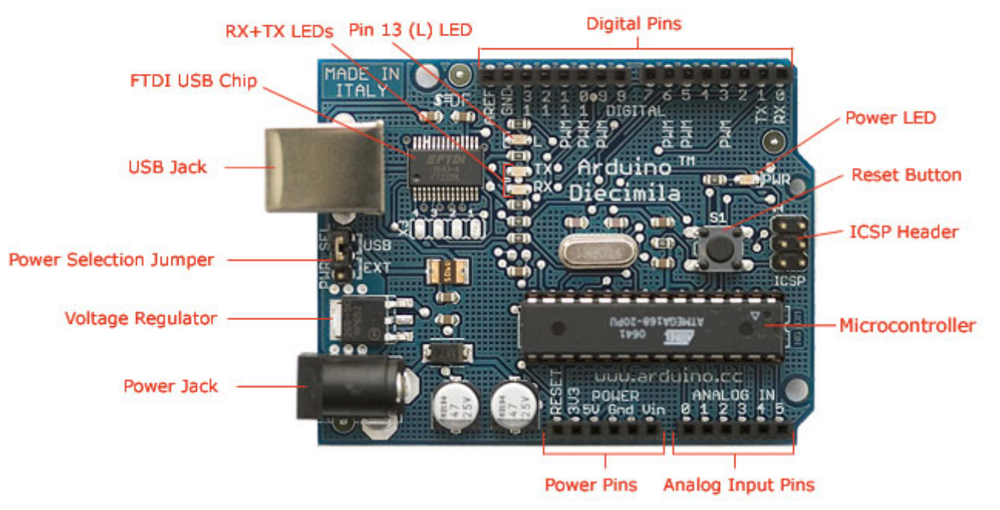
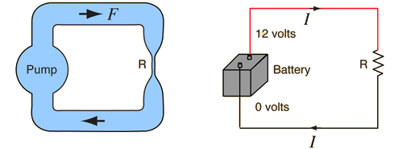
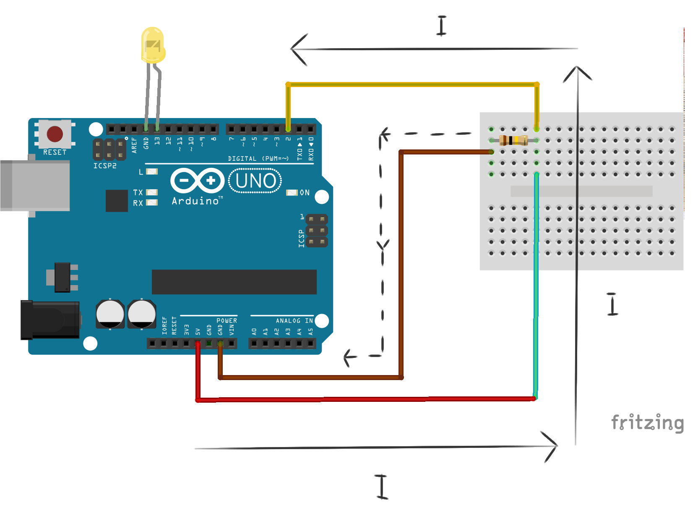
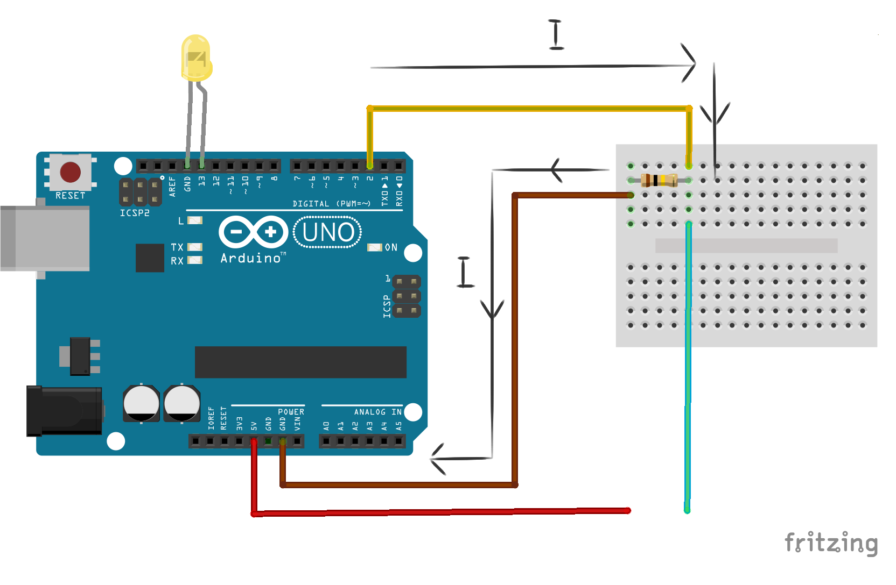

## Recapping: The Arduino 

Last week we introduced the <a href="http://arduino.cc">Arduino</a>; a tiny, programmable computer with dozens of inputs and outputs that we can use to electronically sense and manipulate the world around us:

 

We introduced a couple of the Arduino's basic features: its in-built LED (Light Emitting Diode), its digital output (which we used to light up an external, super-bright LED), and its digital input (which we used, briefly, to make a control switch).

Later today we're going to take a bit of a closer look at the details of how the electrical signals on the Arduino's pins work.

## Recapping: Scratch for Arduino (S4A)

We also introduced a programming environment for the Arduino called <a href="http://s4a.cat">Scratch 4 Arduino</a> (S4A). Which is based on the popular <a href="http://scratch.mit.edu">Scratch </a> programming environment:

We familiarised ourselves with some of S4A's blocks for controlling the Arduino (under "motion"), and wrote programs to blink lights on and off automatically, or using the mouse and the keyboard (and even voice control!).

It's worth remembering that S4A is only *one* way of specifying instructions for the Arduino, which makes it really quick and easy to get started. The official <a href= "http://www.arduino.cc/en/Main/Software">Arduino IDE</a> (Integrated Development Environment) is another way that's a little bit more difficult to get started with, but gives you access to the full speed and capabilities of the Arduino. Here's a comparison of the basic "blinking lights" program we wrote last week, shown using the Arduino IDE and S4A side-by-side:

## Some basic electronics: Ohm's law

Electricity is the flow of energy (in the form of electrons), through conductive materials like metal. 

The three most important properties of electric circuits are **Voltage (V)**, **Current (I)**, and **Resistance (R)**. 

It's sometimes quite useful to compare electronic circuits to water being pumped through a piping system, as in the diagram below (from the <a href= "http://hyperphysics.phy-astr.gsu.edu/hbase/electric/watcir2.html">hyperphysics website</a>, a super useful resource for all things science!):

In this comparison, **Voltage (V)** is like the pressure generated by the pump, it tells us how much *energy* the battery can give electrons to do their stuff with. 

**Current (I)** is like the flow of water through the pipes, it tells us *how many* electrons are passing through the circuit every second (the more electrons, the more powerful!). 

**Resistance (R)** is like a measure of how difficult it is for the water to get through the pipe system - If the pipes are small then the resistance is high (and so the current is low, because less water can get through every second). 

The mathematical relationship between these properties is:

**V = IR**

Which is called *Ohm's law*. What's helpful to know to understand this is that Voltage is normally fixed (it's written on the side of the battery), Resistance depends on the electronic components you're using (lamps, switches, motors), and then you can calculate the amount of current using Ohm's law!

## Another look at the contact switch

Last week, we had a quick look at how to make a physical contact switch to control S4A and the Arduino. Let's have a look at the circuit again, and try and find out what's really going on: 

### Circuit ON

The switch is ON when the input pin (which measures voltage) is connected directly to the 5V. Using our water-pipes comparison, our pump is connected directly to the device that measures the pressure being generated by it. There's a resistor going off to some other part of the circuit, but it's not really doing anything right now - it's so large (i.e. it's so difficult for the electricity to get through it, that it makes almost no difference to the Voltage measured. 

### Circuit OFF

The switch is OFF when the input pin is *disconnected* from the 5V. This is where our clever little the resistor comes in: If we were to disconnect the 5V *without* using this resistor, the electrons at the detector would have nowhere to go (imagine water stuck in a basin). What the resistor does is "drain off" those electrons (like opening a plug-hole in that basin), so that they can escape into the ground.

