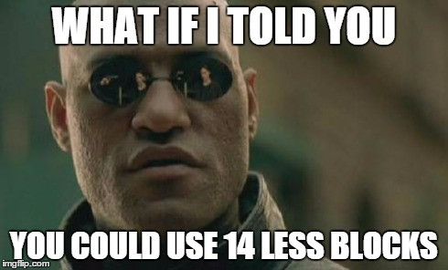
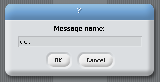
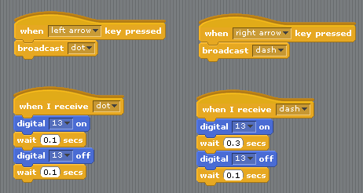
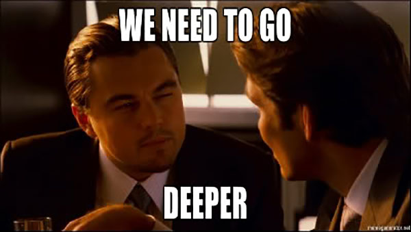

## Let's send morse!!!!

 
So, last week we wrote some programs to send messages in morse code by blinking an LED. <!--Unfortunately our light sniffing companion didn't work as well as we'd hoped. We didn't have time to test him with enough different programs and he missed a lot of what looked to us like perfectly good morse code so firstly, apologies for that. --> As we all found out, this task can quickly get very tricky. Sending just one short word can take a super long time! 

This week we are going to look at ways we can make our lives a whole bunch easier. By using certain patterns and arranging our blocks in clever ways, we can save ourselves a ton of time *and* make our programs a lot easier to understand at the same time. 

First of all, let's look at how most of you guys approached this problem. Here is a program which sends the word Nic :

 

 
This is a 100% correct program and does exactly what it's supposed to, but I think you'll agree it's pretty confusing. What would be great is if we could organise our program in the same way we think about it. Instead of a series of on/wait/off signals, we want to think in dots and dashes. Let's separate out our program so that we can see these a bit more clearly.

 

 
When we separate everything out like this, we can see that a lot of the chunks of our program are actually exactly the same. We are putting in an awful lot of work to make our programs, and doing the same thing over and over. We need to take advantage of the fact that computers are incredibly good at doing boring things over and over again super fast. 

<!--
The DRY principle in software engineering stands for Don't Repeat Yourself. This is always a good thing to keep in mind. Having a DRY program is much better than having a WET program (Write Everything Twice) for a few rea
-->

In Scratch, we can use something called broadcasting to do this. What we want to do is only make the code to send a dot once, and only make the code to send a dash once. We put this code under a "when I receive" control block. Drag one onto the stage and click the triangle to make a new broadcast message.

We will name our first message "dot" and make another one called "dash"

We trigger these blocks by broadcasting their message from somewhere else in our program. We can do this for example, when a key is pressed :

Using these handy blocks, we can now send the word "Nic" like this :

This is definitely a bit easier to understand than before. Here is what sending the word "Hello" looks like :

Notice how we are still repeating ourselves every time we want to write the same letter.

 

 - What if we wanted to change our interval?
 - Let's add a dotTime variable, and specify everything using that
 
 - Add Spaces?
  
 - So yeah, adding all of the letters is gonna take aaaaaaaages. Luckily, here's one we prepared earlier.
 

