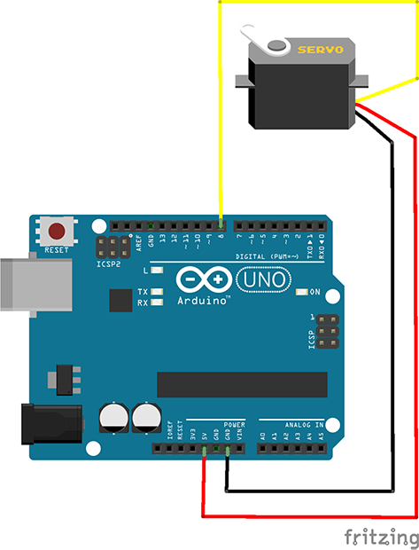
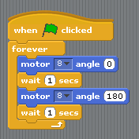
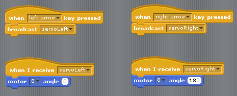
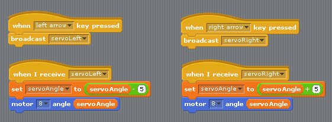
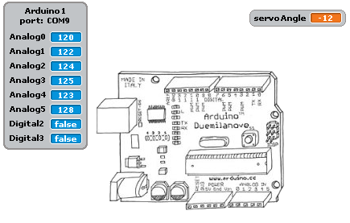
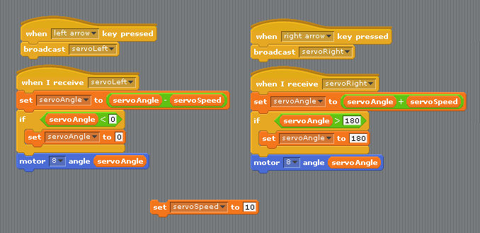

Last week, we gave you an introduction to the wonderful world of servos. Our versatile little friends are used in hundreds of different ways, from robot arms, legs and steering to the regulators and switches keep power plants from blowing up!

Here's a reminder of the important details:

This is the diagram showing you how to wire up your servo. Remember the wires on your ones may be slightly different colours, but they all work the same.  

 - Red           : 5V
 - Black/Brown   : Ground
 - Yellow/Orange : Pin 8 (control signal)

 
 

We used some of the jumper wires we gave you in the first class to bridge the connection between the sockets on the servos and our breadboard - the colours of the jumper wires are not important, but you might find it easier to use the same colours as the wires coming out of the servo!

We showed you that you can find the control block for a servo in the usual "motion" section of S4A: it's the one that says "motor **8** angle **180**". This block sets the **angle** of the servo arm connected to pin **8** to anywhere between 0 and 180 (just like the angles on a protractor!).

 

 
Most of you will have put together an example control loop that looked something like this, which tells your arm to wiggle back and forth from 0 to 180 every second:

 
And some others might have used broadcasts to control the wiggling with keypresses:

 
But today, rather than just moving from one side to the other like a wind-screen wiper (or a waving machine!), we'd like to show you how to use key-presses to move the servo arm bit-by-bit, to any position between 0 and 180. And to make our lives easier we're going to be using all of the tricks we learned in our morse-code examples from weeks 2 and 3.

If we want to move our servo only a little bit left or right, we need to have a way of knowing where it is. We can do that by storing our servo angle in a variable. Below we have made a new variable called servoAngle, and changed our code to use this variable instead of typing in numbers to the "motor 8 angle" block.

 
Now what we can do is add or subtract stuff from this variable, and our servo will move left or right just a little bit from wherever it already is. There is a bit of a problem with this code though, have a play around and see if it behaves in a way you didn't expect.

 
You might have noticed that when we move below 0 or above 180, the servo doesn't go back the other way straight away. This is because our variable is going outside the 0-180 range of our servo, and when we start moving back the other way, we have to wait for it to come back inside the range. This is probably not how we would like it to behave.

 

 
To fix this what we need to is, wheen we move left check whether servoAngle has gone below 0. Also, every time we move right, check whether it has gone above 180.

To do this, we will have to use some of the green "operators" blocks. 

  - The " < " block checks whether the thing on the left is *smaller* than the thing on the right
  - The " > " block checks whether the thing on the left is *bigger* than the thing on the right

 

 
This is much better, and probably works the way you would expect it to. Now what if we wanted to make it go faster or slower? Again, we don't want to have to change this in two different places so let's make a new variable called servoSpeed, set it to something bigger than 5, then use this value in our servoLeft and servoRight code.

