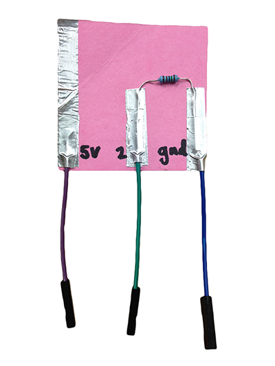

## Paper Switch

 
So far we have been using a breadboard and jumper wires to prototype our circuits. This is super useful when we are still playing with our circuit design, because it lets us rearrange things very quickly and easily. What about when we are happy with our design and want to keep it? Well, one way that we could do this is to use conductive tape, and lay our circuit out on paper. 

This is our switch circuit laid out with conductive tape. To close the switch all we need to do is to fold down the corner so that the 5V connection touches the connection going to pin 2. You can even add little female jumper wire attachments so that your switch is super easy to wire into your Arduino, like I have done here.

The paper circuit is exactly the same as our switch from last week. If you look closely all the same things connect together. As long as electricity flows around our circuit in the same way, it will behave exactly the same. If we pop an LED in pin 13, we can use this same block of code from last week to turn the LED on and off.

## Paper Circuits

We could use lots of other things instead of wires to create our circuit. Anything that conducts electricity will work. Conductive tape is really handy, but if you don't have any at home you can try using things like paperclips and tin foil. You can even buy special <a href="http://www.bareconductive.com/shop/
">paint</a> now that conducts electricity, and even <a href="https://123d.circuits.io/shop/circuitscribe#accessories">pens</a> that write with conductive ink. 

Here are a few cool projects for inspiration.

<iframe width="640" height="480" src="https://www.youtube.com/embed/AI-6wMlaVTc" frameborder="0" allowfullscreen></iframe>

 

<iframe src="https://player.vimeo.com/video/40904471" width="640" height="360" frameborder="0" webkitallowfullscreen mozallowfullscreen allowfullscreen></iframe> 
<a href="https://vimeo.com/40904471">Interactive Light Painting: Pu Gong Ying Tu (Dandelion Painting)</a> by <a href="https://vimeo.com/user1892233">Jie Qi</a>

<!--
http://www.creativeapplications.net/sound/paper-electronics-by-coralie-gourguechon/

Arduino free paper circuit ideas:

http://highlowtech.org/?p=2505

 - Talk about soldering / proto boards
 - Talk about PCB etching
 - Hook up the switch to turn pin 13 on/off
-->
