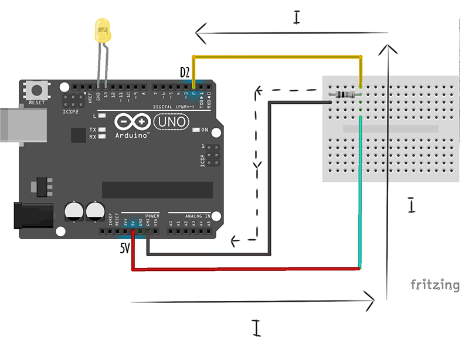
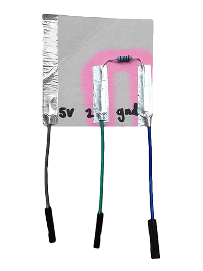

## Switch Recap

 

So we can now control our robot with keyboard commands if we want to. But what if we wanted our robot to have its controls actually built in? Remember our switch from week 1? Let's have a quick look at it again, and see how it works.

When the switch is closed current flows directly from 5V into pin 2, giving us a high voltage reading in pin 2 :

 
When the switch is open, all the remaining charge flows away into ground, like a sink being drained :

So far we have been using a breadboard and jumper wires to prototype our circuits. This is super useful when we are still playing with our circuit design, because it lets us rearrange things very quickly and easily. What about when we are happy with our design and want to keep it? Well, we could design and print a circuit board (like the one the arduino is built on), but that takes a lot of time and money - a much more quick and cheap way would be to use conductive tape, and lay our circuit out on card or paper. 

Below is a picture of the exact same circuit we showed you above but laid out with conductive tape on card. To close the switch all we need to do is to fold down the corner so that the 5V connection touches the connection going to pin 2. You can even add little female jumper wire attachments so that your switch is super easy to wire into your Arduino, like I have done here.

<!--

-->

The paper circuit is **exactly the same** as our switch diagram above. If you look closely, you will see that all the same things connect together. As long as electricity flows around our circuit in the same way, it will behave exactly the same. Here is how the electricity flows when our switch is closed. Just as above, current flows directly from 5V into pin 2, giving us a high voltage reading.

 
And when we disconnect it, just as above, all the charge left on pin 2 drains away into ground.

 
If we pop an LED in pin 13, we can use this same block of code from the first week to turn the LED on and off.

 
If we make two of them, and have one in pin 2 and one in pin 3 then controlling our new fancy broadcast controlled servos is as easy as this :

<!---

-->

 

## Paper Circuits

 
We could use lots of other things instead of wires to create our circuit. Anything that conducts electricity will work. Conductive tape is really handy, but if you don't have any at home you can try using things like paperclips and tin foil. You can even buy special <a href="http://www.bareconductive.com/shop/
">paint</a> now that conducts electricity, and even <a href="https://123d.circuits.io/shop/circuitscribe#accessories">pens</a> that write with conductive ink. 

Here are a few cool projects for inspiration.

<iframe width="640" height="480" src="https://www.youtube.com/embed/AI-6wMlaVTc" frameborder="0" allowfullscreen></iframe>

 

<iframe src="https://player.vimeo.com/video/40904471" width="640" height="360" frameborder="0" webkitallowfullscreen mozallowfullscreen allowfullscreen></iframe> 
<a href="https://vimeo.com/40904471">Interactive Light Painting: Pu Gong Ying Tu (Dandelion Painting)</a> by <a href="https://vimeo.com/user1892233">Jie Qi</a>

<!--
http://www.creativeapplications.net/sound/paper-electronics-by-coralie-gourguechon/

Arduino free paper circuit ideas:

http://highlowtech.org/?p=2505

 - Talk about soldering / proto boards
 - Talk about PCB etching
 - Hook up the switch to turn pin 13 on/off
-->
