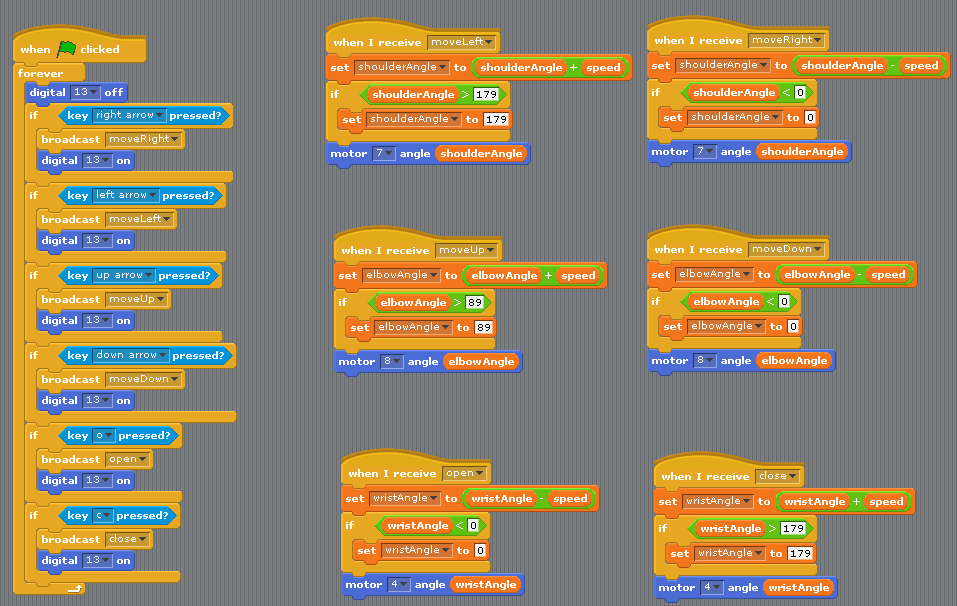

Remember our servo controller code from a couple weeks ago? Today we are going to look at how to expand that to let us control all 3 servo motors in our robot arm. 

 

The main thing that we need to do is change our single **servoAngle** variable into 3 different variables for each joint of the arm. Each of these will have to have broadcast messages to control them, and each has a maximum range that we want it to move in

 - **shoulderAngle** has "moveLeft" & "moveRight" broadcasts, and a range of 0-180
 - **elbowAngle** has "moveUp" & "moveDown" broadcasts, and a range of 0-90
 - **wristAngle** has "open" & "close" broadcasts, and a range of 0-180

 
 Then we need to make a main control loop that checks for key presses, and sends broadcasts to control the servos

