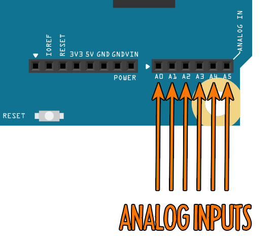
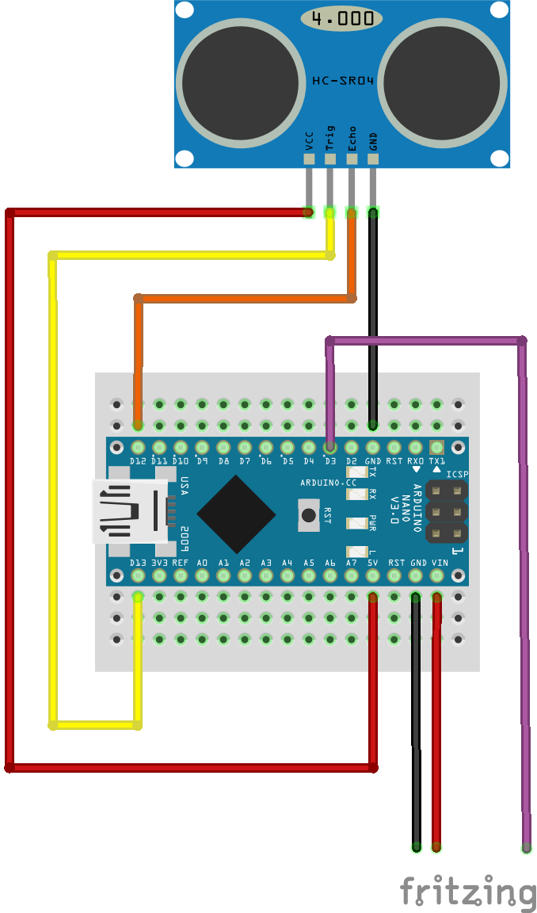

 

The galileo can receive and send many different types of signal on many of its different pins. The pins we're going to be using today to receive signals are shown below:

These pins can recieve voltages between 0 and 5 Volts: If you attach a device that outputs any voltage between those values to any of these pins, that voltage will be displayed on the "inputs" display on the Connect Anything website.

## Push button
 

This push button circuit will send either 5V (when pressed) or 0V to the galileo. The input is connected to 0V via a large resistor (>1 kOhms), this ensures that any stray charge at the input can be drained away to ground. When the push-button is pressed, it makes a direct connection between 5V and the input. This connection has a much lower resistance (<1 Ohm) than the connection to ground, which causes charge to build up at the input until it reads 5V.

This is the basic principle of most on/off switches!

## Light Dependent Resistor (LDR) input
 

LDRs change their resistance depending on how much light shines on their surface. They can be used to measure light levels in a variety of applications, from weather stations to morse decoders. The circuit below uses the *voltage-divider* principle to detect a change in resistance as a change in voltage.

## Range sensor (Arduino) input
 

This range sensor is controlled by an arduino UNO. This circuit demonstrates that you can use your galileo to read signals from other microcomputers! The range sensor works using bat-like ultrasound: it sends out an inaudible beep and waits until it hears the echo. The longer it takes to hear the echo, the further away the object that the sound wave hit is!

The UNO measures the time delay and converts that to an analog signal which is sent to the galileo via *low-pass filter* (more info in the handouts).