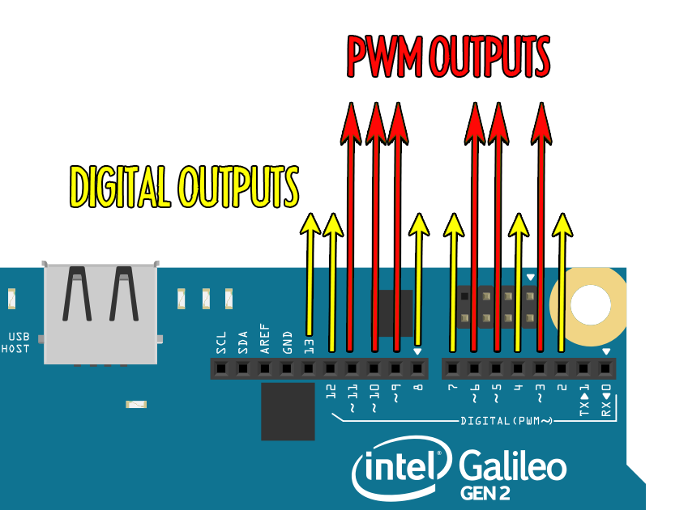
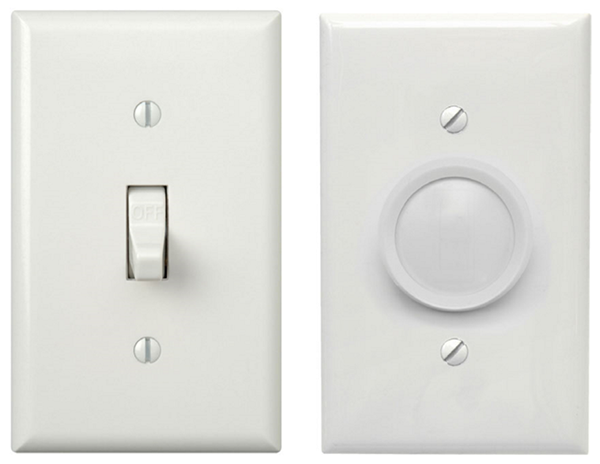
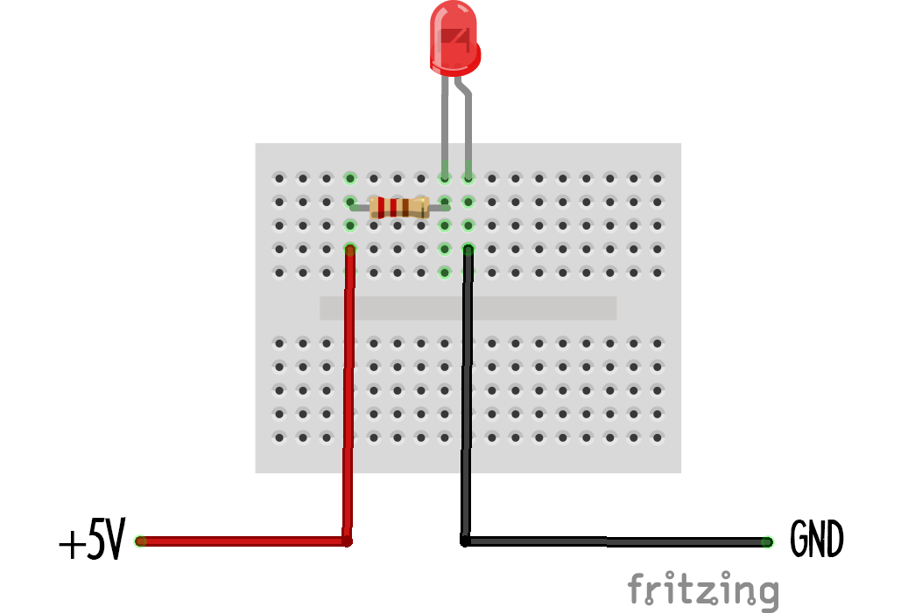
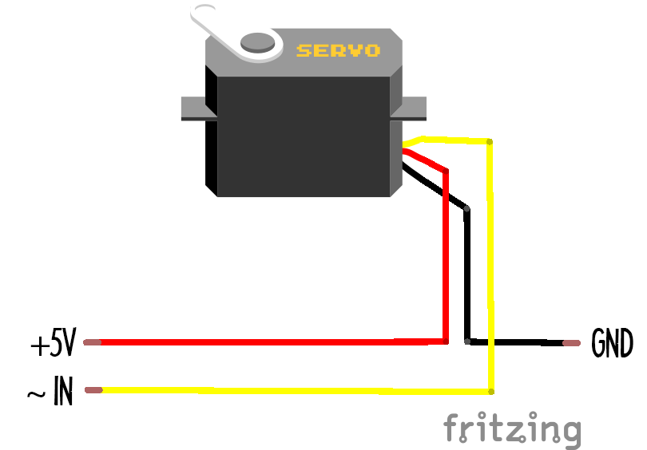

 

The outputs of the galileo are shown in the diagram below:

The galileo can output two types of signal: *Digital* on/off signals, and *Analog* continuous signals (labelled PWM) - think of it like the difference between a regular light-switch and a dimmer switch.

The board can output *digital* signals on any of its pins (labelled 0-13). It can only output an *analog* signal on pins marked with a "***~***" (pronounced 'tilde'), so that's pins ~3, ~5, ~6, ~9, ~10 and ~11.

The galileo (and all other arduino-compatible boards) use a technique called "PWM" to generate analog signals. This technique is good enough for a lot of day-to-day applications, but not so much for others. See the handout on Low Pass Filters for more info.

## Light-Emitting Diode (LED)
 

An LED is a simple example of an analog output: the light can either be off completely or any brightness up to a maximum. LED circuits need a resistor in them in order to limit the current passing through the LED - this stops it from overheating and blowing up! 

It's also important to put the LED in the right way around. You'll notice that one leg of the LED is longer than the other - this end must go on the *positive* side of the circuit, and the other goes on the *negative* end.

## Servo (includes the robot arm)
 

A servo is a lot like a motor, but instead of being designed to turn with as much *power* as possible, it's designed to turn with as much *accuracy* as possible. As a result, it doesn't turn full circle. Instead it turns half a circle, from 0 to 180 degrees.

The robot arm on one of the galileos is just three of these mounted inside a 3d-printed armature. Wire each one to a different analog output on your board.

## LED ring output
 

The LED rings on two of the galileos are controlled by arduino UNOs, which are like galileo's but with less features. This circuit shows you that you can control other microcomputers from your galileo!

Like the galileo, the UNO has 5 analog inputs. This one has been programmed to accept signals sent to pins A0 and A1. The diagram below shows you how to connect an output of your galileo to an input of the arduino. You'll notice there are a couple of extra components in this circuit! This is a low pass filter circuit - it's there to 'clean up' the PWM signal coming out of the galileo - there's more info in the "Low Pass Filters" handout.

<!-- ## X11 mains output
 

Description

-->