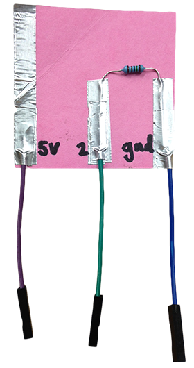
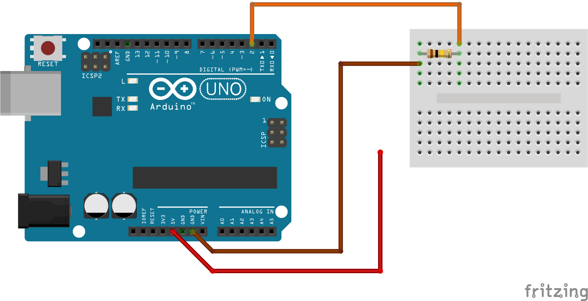

## Paper Switch

 
So far we have been using a breadboard and jumper wires to prototype our circuits. This is super useful when we are still playing with our circuit design, because it lets us rearrange things very quickly and easily. What about when we are happy with our design and want to keep it? Well, one way that we could do this is to use conductive tape, and lay our circuit out on paper. 

This is our switch circuit laid out with conductive tape. To close the switch all we need to do is to fold down the corner so that the 5V connection touches the connection going to pin 2. You can even add little female jumper wire attachments so that your switch is super easy to wire into your Arduino, like I have done here.

The paper circuit is exactly the same as our switch from last week. If you look closely all the same things connect together. As long as electricity flows around our circuit in the same way, it will behave exactly the same. If we pop an LED in pin 13, we can use this same block of code from last week to turn the LED on and off.

