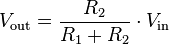

 

A lot of the input circuits we're working with today work on the principle of a 'voltage divider' (e.g. the Light Dependent Resistors, the potentiometers, and even the push-button switches).

A voltage divider is a simple circuit which turns a high voltage (*Vin*) into a lower one (*Vout*). The circuit can be drawn in many ways, but below is a pretty typical way of showing it (<a href='https://commons.wikimedia.org'>cc Wikipedia</a>)

We call the resistor closest to *Vin* R1, and the resistor closest to ground R2. The voltage drop across R2 is called *Vout*, and that's the voltage we measure or use to drive other circuits. 

We can calculate what *Vout* would be if we know *Vin* and the resistances by using the voltage divider equation:

Do you see R1 there in the denominator? That means that if we *increase* R1, we *decrease* *Vout* and vice-versa. Likewise if we *increase* or *decrease* R2, we *increase* or *decrease* *Vout* in turn!