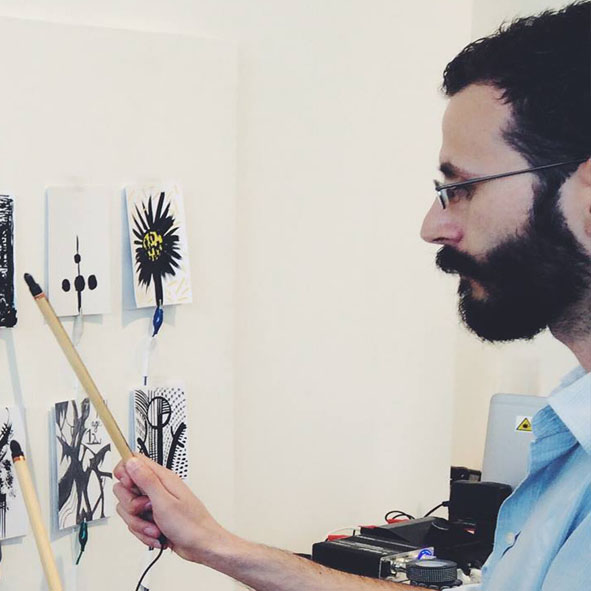
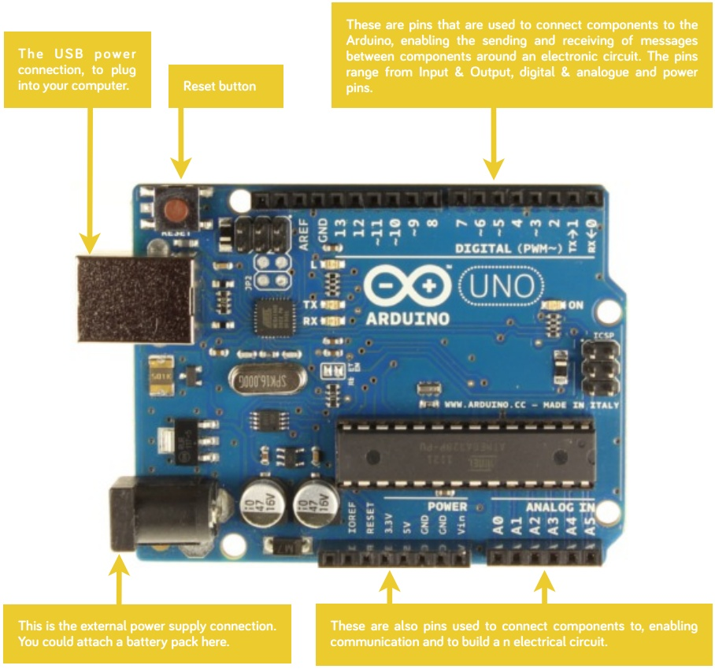

Welcome to <a href="http://makerclub.org">Maker Club</a>’s <b>Let’s Build Robots!</b>, a 6 week course being held at <a href="http://makerclub.org/makerlab">Maker Lab</a>, a community hub dedicated to digital education in Brighton. 

## Who are we?

<a href="http://digitaltinkerings.com">Louis d’Aboville</a> is a digital tinkerer and toy hacker based in Brighton, he helps to run creative workshops for young people as part of <a href="http://exploringsenses.co.uk">Exploring Senses</a>, and creates interactive projections for a range of events.

<a href="http://makerclub.org">Mo Griffin</a> helps to run the Maker Lab!

Insert a picture of Mo

<a href="http://seymoursmith.net">Nic Seymour-Smith</a> is a teacher, programmer and electronic engineer. He tutors for the <a href="http://brighton.ac.uk">University of Brighton’s</a> Digital Media Arts course, runs digital skills workshops and builds interactive technology pieces for small companies and big businesses alike. 

## So what exactly is a robot?

TODO : write some stuff about robot definitions

## So what exactly is a computer?

TODO : write some stuff about memory and programs and that
 - Has Memory
 - Can run a program
 - Can output stuff

## So what is an Arduino anyway?

An Arduino is a small programmable computer that we can use to make all kinds of clever interactive gadgets and gizmos. It is not like most computers you have used in the past because of it's inputs and outputs.

Your normal laptop computer uses things like a mouse and keyboard for input, and outputs images and sound. The Arduino uses things like switches or sensors for input, and can control things like lights, motors, and other physical outputs. 

Although it's inputs and outputs are different, just like any other computer we can program it. This means we can tell it what to do with it's inputs, how to store and use that information, and how to use that to control it's outputs.

This is an Arduino Uno :

## Programming the Arduino

Normally, if we wanted to program an Arduino (or any other computer for that matter) we would have to write some code to tell it what to do. This code has to be written in a very specific way so that the Arduino understands *exactly* what you want it to do.
 
This is what the code to blink an LED on and off looks like :


void setup() 
{
  pinMode(13, OUTPUT);      // Set pin 13 up as an output. 
                            // Pin 13 has an LED built in.
}

void loop() 
{
  digitalWrite(13, HIGH);   // turn the LED on (HIGH is the voltage level)
  delay(1000);              // wait for a second
  digitalWrite(13, LOW);    // turn the LED off by making the voltage LOW
  delay(1000);              // wait for a second
}


This is a bit of a confusing place to start if you have never done any programming, but luckily for us some clever folks in Spain have made a tool called S4A (or Scratch for Arduino) that let's us control the Arduino using custom blocks that they have added to Scratch. For an intro to S4A, go check out the Week 1 Worksheet

## Scratch 4 Arduino

We have already set up all of the laptops and Arduinos at the MakerLab to use S4A but if you want to download it on your computer you can grab it on the <a href="http://s4a.cat">S4A website</a>, where there is a bunch more information about the project.