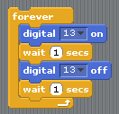
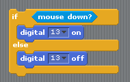
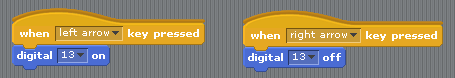
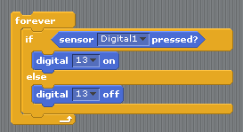

<a href="http://s4a.cat">Scratch 4 Arduino</a> is a custom version of scratch that makes it super easy to get up and running with Arduino programming. This worksheet is going to show you how to get set up and start making your first programs using S4A.

 </img>

For a great little introduction to S4A, check out the first 10 pages or so of <a href="http://seymoursmith.net/lesson-site/img/S4A Presentation.pdf">this presentation</a>. When you first launch the program, if you don't have your Arduino connected your stage (the bit at the top right of your screen) will look like this : 

When you connect the Arduino, the "Searching" should disappear and the numbers on the analog pins should start jumping around

Up in the top left of your screen are all the different categories of Scratch blocks for making your program.

If you go to the blue "Motion" section, you should see all of S4A's special Arduino blocks. We will look at all of these over the coming weeks, but to start off with, we are going to concentrate on using these two : 

These let us turn pins 10-13 on or off. It just so happens that the Arduino has an LED light already attached to pin 13. Try dragging these blocks into your workspace, clicking on them to turn the LED on and off and see if you can spot where it is on the board.

# Controlling the onboard LED

There are a whole bunch of different ways we can control stuff in Scratch. Let's look at a few interesting ways of turning our light on and off.

### Looping
This script will blink your LED on and off every second (with S4A the fastest this can be is every 0.7 seconds)

### Mouse Control
This script turns the LED on whenever your mouse button is pressed

### Keyboard Control
These scripts turn the LED on when you press the left arrow key, and off when you press the right arrow key.

You may well have used some (or all) of these methods before to control your scratch projects. One of the cool things that we can do with an Arduino that we can't do in Scratch is use the Arduino's pins as inputs. Here is a diagram showing you how to set up a simple circuit to use digital pin 2 as a switch.

## INSERT CIRCUIT DIAGRAM

# Digital Sensor Input
This script will turn the LED on or off, depending on whether your switch circuit is open or closed.

With this circuit, you can now use your switch to control things in Scratch too! try getting something to happen in scratch whenever your LED lights up.

# Controlling an external LED

So Scratch's onboard LED is OK, but it's not the brightest LED in the world, and we have no way of putting it where we want, or changing it's colour. Knowing how to use external LEDs is a super useful thing (especially with robots - colourful blinky lightsare a must have!) This circuit shows you how to attach an external LED to pin 13.

## INSERT CIRCUIT DIAGRAM

Because this is on the same pin as the onboard LED, we don't have to change any of our scripts for this to work :)

<!---

-->
>>>>>>> 8bfcdaa8fd6c241e2a72085c9f9da75be9c031ba
