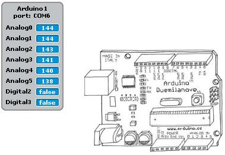

<a href="http://s4a.cat">Scratch 4 Arduino</a> is a custom version of scratch that makes it super easy to get up and running with Arduino programming. This worksheet is going to show you how to get set up and start making your first programs using S4A.

For a great little introduction, check out the first 10 pages or so of <a href="http://seymoursmith.net/lesson-site/img/S4A Presentation.pdf">this presentation</a>

When you first launch S4A if you don't have your Arduino connected you will see this message

When you connect the Arduino, this should disappear and the numbers on the analog pins should start jumping around 

If you go to the blue "Motion" section at the top left, you should see all of S4A's special Arduino blocks

TODO : List all blocks? Maybe just look at pin 13, and poke about with analog out and digital in pins

TODO : Add all the examples of different ways to control the onboard LED