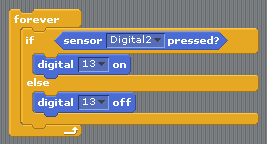

<a href="http://s4a.cat">Scratch 4 Arduino</a> is a custom version of scratch that makes it super easy to get up and running with Arduino programming. This worksheet is going to show you how to get set up and start making your first programs using S4A.

For a great little introduction, check out the first 10 pages or so of <a href="http://seymoursmith.net/lesson-site/img/S4A Presentation.pdf">this presentation</a>

When you first launch S4A if you don't have your Arduino connected you will see this message

When you connect the Arduino, this should disappear and the numbers on the analog pins should start jumping around 

If you go to the blue "Motion" section at the top left, you should see all of S4A's special Arduino blocks. We will look at all of these over the coming weeks, but to start off with, we will concentrate on these two : 

These let us turn pins 10-13 on or off. The Arduino has an LED light already attached to pin 13. Try dragging these blocks into your workspace, turn the LED on and off and see if you can spot where it is on the board.

# Controlling the onboard LED

There are a whole bunch of different ways we can control stuff in Scratch. Let's look at a few interesting ways of turning our light on and off.

### Looping

This will blink your LED on and off every second (with S4A the fastest this can be is every 0.7 seconds)

### Mouse Control

This turns the LED on whenever your mouse button is pressed

### Keyboard Control

These turn the LED on when you press the left arrow key, and off when you press the right arrow key.

You may well have used some (or all) of these methods before to control your scratch projects. One of the cool things that we can do with an Arduino that we can't do in Scratch is use the Arduino's pins as inputs. Here is a diagram showing you how to set up a simple circuit to use digital pin 2 as a switch.

## INSERT CIRCUIT DIAGRAM

### Digital Sensor Control

When you connect the switch the LED will turn on, and when it's not connected it will be off.

With this circuit, you can now use your switch to control things in Sratch too! try getting something to happen in scratch whenever your LED lights up.

### Controlling an external LED

So Scratch's onboard LED is OK, but it's not the brightest LED in the world, and we have no way of putting it where we want, or changing it's colour or anything. This circuit shows you how to attach an external LED to pin 13.

## INSERT CIRCUIT DIAGRAM

Because this is on the same pin as the onboard LED, we don't have to change any of our scripts for this to work.

<!---

-->
