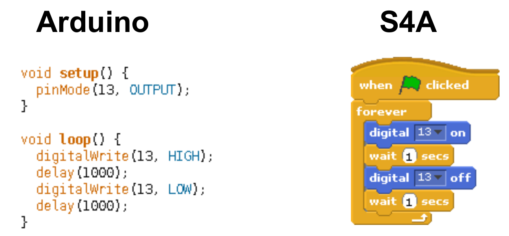
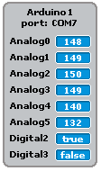

## Recapping: The Arduino 

Last week we introduced the <a href="http://arduino.cc">Arduino</a>; a tiny, programmable computer with dozens of inputs and outputs that we can use to electronically sense and manipulate the world around us:

 

We introduced a couple of the Arduino's basic features: its in-built LED (Light Emitting Diode), its digital output (which we used to light up an external, super-bright LED), and its digital input (which we used, briefly, to make a control switch).

Later today we're going to take a bit of a closer look at the details of how the electrical signals on the Arduino's pins work.

## Recapping: Scratch for Arduino (S4A)

We also introduced a programming environment for the Arduino called <a href="http://s4a.cat">Scratch 4 Arduino</a> (S4A). Which is based on the popular <a href="http://scratch.mit.edu">Scratch </a> programming environment:

We familiarised ourselves with some of S4A's blocks for controlling the Arduino (under "motion"), and wrote programs to blink lights on and off automatically, or using the mouse and the keyboard (and even voice control!).

It's worth remembering that S4A is only *one* way of specifying instructions for the Arduino, which makes it really quick and easy to get started. The official <a href= "http://www.arduino.cc/en/Main/Software">Arduino IDE</a> (Integrated Development Environment) is another way that's a little bit more difficult to get started with, but gives you access to the full capabilities of the Arduino. Here's a comparison of the basic "blinking lights" program we wrote last week, shown using the Arduino IDE and S4A side-by-side:

# Making our own switch

You may well have used some (or all) of the methods above to control your scratch projects in the past. One of the cool things that we can do with an Arduino that we can't do in Scratch is use the Arduino's pins as inputs. Here is a diagram showing you how to set up a simple circuit to use digital pin 2 as a switch.

If we want to turn our switch on, we have to connect the wire from 5V as show below. Please check carefully before you do this, as we could damage our LED if we do this the wrong way round! The wire from 5V always needs to be plugged into the same end of the resistor as the wire from pin 2. 

When you close the switch, on your stage (in the top right) you should see the value of Digital2 turn from "false" to "true"

If you see this happening, congratulations! You have just made your first circuit with an Arduino! If this isn't working like it should then double check your wiring against the diagrams above. 

If we want to use this in a script, we will need to use a new block, the "sensor pressed" block. Here's an example of using the sensor pressed block to control our LED.

With this circuit, you can now use your switch to control all kinds of things in Scratch too! Try getting something to happen in scratch whenever your LED lights up. Maybe even try getting a game or animation in scratch to control your LED too!

<!---

-->
