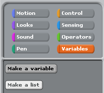
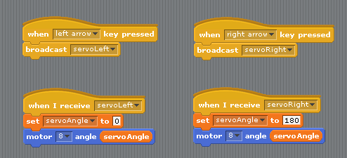

 
So, last week we wrote some programs to send messages in morse code by blinking an LED. 

Unfortunately our little light sniffing companion didn't work as well as we'd hoped. We didn't have time to test him with enough different programs and he missed a lot of what looked to us like perfectly good morse code so firstly, apologies for that. 

As we all found out, this task can quickly get very tricky. Sending just one short word can take a super long time! 

This week we are going to look at ways we can make our lives a whole bunch easier. By using certain patterns and arranging our blocks in clever ways, we can save ourselves a ton of time *and* make our programs a lot easier to understand at the same time. 

First of all, let's look at how most of you guys approached this problem. Here is a program which sends the word Nic 

 

 
This is a 100% correct program and does exactly what it's supposed to, but I think you'll agree it's pretty confusing. What would be great is if we could organise our program in the same way we think about it. Instead of a series of on/wait/off signals, we want to think in dots and dashes. Let's separate out our program so that we can see these a bit more clearly.

 

 
When we separate everything out like this, we can see that a lot of the chunks of our program are actually exactly the same. We are putting in an awful lot of work to make our programs, and doing the same thing over and over. We need to take advantage of the fact that computers are incredibly good at doing boring things over and over again super fast. 

## Broadcasts

 
The DRY principle in software engineering stands for Don't Repeat Yourself. This is always a good thing to keep in mind. Having a DRY program is much better than having a WET program (Write Everything Twice) because it saves us a ton of time in the long run, and also makes our programs a lot easier to understand.

In Scratch, we can use something called broadcasting to do this. What we want to do is only make the code to send a dot once, and only make the code to send a dash once. We put this code under a "when I receive" control block. Drag one onto the stage and click the triangle to make a new broadcast message.

We will name our first message "dot" and make another one called "dash"

The dot block needs to :

- Turn the LED on
- Wait 0.1 seconds
- Turn the LED off
- Wait 0.1 seconds (to leave a gap before the next dot/dash)

 
The dash block needs to :

- Turn the LED on
- Wait 0.3 seconds
- Turn the LED off
- Wait 0.1 seconds (to leave a gap before the next dot/dash)

 
We can then trigger these blocks by using a broadcast block somewhere else in our program. Here is an example that lets us type our morse code in manually using the left and right arrow keys.

If we want to have a script send a whole series of dots and dashes, in stead of "broadcast", we will have to use "broadcast and wait." This is so that the script waits until we have finished sending the first dot/dash before it starts sending the second. If we just had lots of "broadcast" blocks, our program would try to send all of the dots and dashes at once. Here is an example which sends the word "Nic."
 

This is definitely a bit easier to understand than before, but when we start sending longer words it can still get a bit fiddly. Here is what sending the word "Hello" looks like 

Notice how we are still repeating ourselves every time we want to write the same letter.

 

What would be great is if every time we want to write an L, we didn't have to go and look up the morse code for the letter L. We can use exactly the same technique to make a broadcast message for the letter L, and have a script that automatically sends broadcast messages for dot dash dot dot. Here is an example that uses this technique to send the word Hello every time we press the space bar.

 

## Variables

 
Notice that all of the "wait" blocks have numbers that we are typing in based on our dot being 0.1 seconds long. What if we wanted to change our dotTime? We would have to go through all of the letters, and change our wait time, and in our dot and dash scripts, we would have to change those numbers too. We can use variables to get around this, and make a program that is even more clever and adjustable. In the orange "variables" tab in the top left, click on "Make a new variable"

In the window that pops up, we want to call our variable by a name that makes sense for what we are using it for. We called ours "dotTime"

Now that we have created our variable, there are some new blocks available in the "variables" section.

We want to drag the block that says "set dotTime to 0" on to our scripting area, change the number to 0.1 and double click it to run it.

Once we have done this, in the top left of your stage you should see your variable with it's new value.

Because in morse code, all of the timings depend on how long a single dot is, we can use our dotTime variable everywhere we want to set a time to wait. If we want to change our timings, all we should have to do is change the dotTime variable, and everywhere in our scripts that we are using it should automatically use the new value. Here is what our scripts look like when we use variables. Can you see how all of our timings fit the rules? The numbers might not be what you expected, but think about what order these scripts get run in.

 

Writing these scripts for every single letter in the alphabet is going to take a long time at first, but in the long run, will actually save us a ton of time when we want to send different messages. Luckily, we are not so mean that we are going to make all of you do this, and we have made a program that uses all of these techniques to send every letter of the alphabet which you can download by clicking on this guy :

<!--

## Controlling Servos

-->