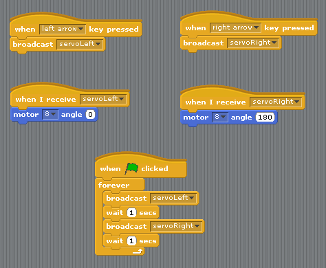

So now we will look at how we can use all the lessons we have learned from doing our morse code to help us make something a bit more robot-y, and control a servo motor. Servo motors are used all over the place in robotics. Servo motors are different to regular motors, because we can tell them exactly where to move to, which is pretty handy when you want your robot to move it's arm to a specific place.

So far, we have only had to plug our components into 2 pins on the Arduino, one into 5V power, and one into ground. This is like plugging it into the two ends of a battery. Our servo needs power just like anything else, but if you look at the servo you'll see it actually has 3 wires. This is because we also need to be able to send it a control signal to tell it where to go.

Here is a diagram showing you how to wire up your servo. The wires on your ones are different colours to this diagram, but they do the same thing. 

 - Red           : 5V
 - Black/Brown   : Ground
 - Yellow/Orange : Pin 8 (control signal)

 
 

If you look in the "motion" section, where all of our arduino blocks are, you should see one that says "motor 8 angle 180" This is the block that sends a control signal to the servo to tell it where to rotate to. The reason it says 180 is because that is the maximum range of our servos. This means it can move around anywhere within a half circle.

Try sending it a value of 180, then sending it a value bigger than 180. It doesn't move because it is already as far right as it can go. The same thing will happen if you send it a 0 and then send it a number smaller than 0 (eg -10)

 

 
Here is a simple program that makes our servo wiggle back and forth.

 
But what if we want to be able to control our servo manually? Let's use the things we learned sending morse code and see if we can make a cool control system using the keyboard. First of all, we want to create broadcast messages for servoLeft and servoRight. Then we will call these every time we press the left and right arrow keys. 

Now we can wiggle our servos around manually, woooohooo!

 
Here we have combined these two programs so we have a wiggling servo that also has keyboard control. 

