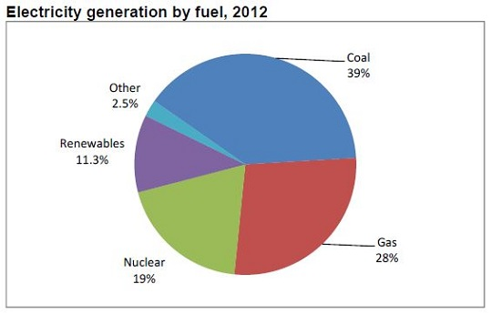
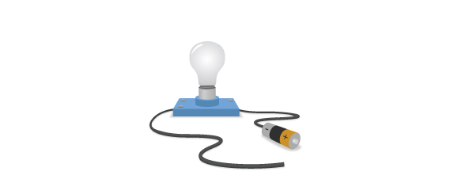
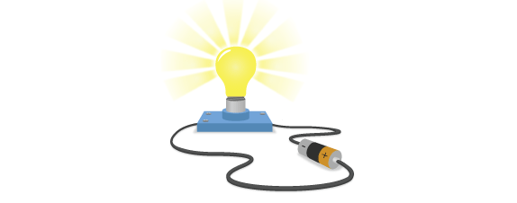
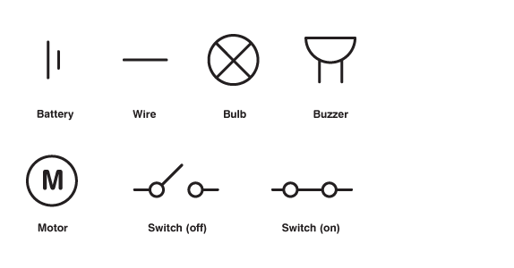
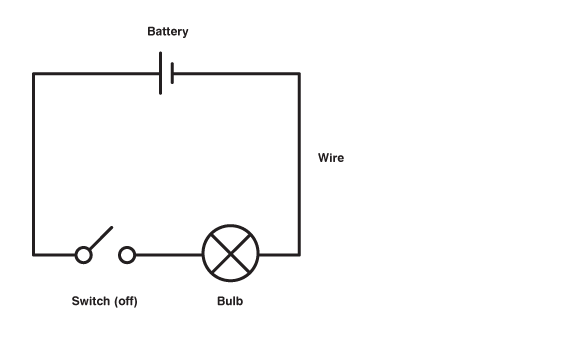
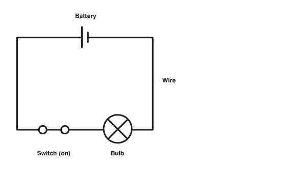

## Circuits

Electricity is a type of energy source that can be used to power a huge range of useful devices. We can get electric energy from a variety of sources - Power stations that burn fossil fuels or use water and theogermal energy, solar panels, batteries that use chemical energy, and even hand-powered dynamos. 

These power sources always have a postive (+) and a negative (-) end. A working electronic circuit always needs a power source, and its wires must connected to both the positive (+) and negative (-) ends. 

In order to be a useful circuit, it must also contain useful electrical components, such as bulbs, buzzers or motors, which allow electricity to pass through as they run.

One important thing to remember is that electricity will only travel around a circuit that is **complete** - that means that there is an unbroken connection between the positive and negative ends.

## Circuit diagrams and symbols
Circuit diagrams are a quick and simple way to show and share electronic circuits so that other people can make them. They use symbols to represent physical components like bulbs, switches and motors:

The light bulb circuits we saw above can be represented by these circuit diagrams:

